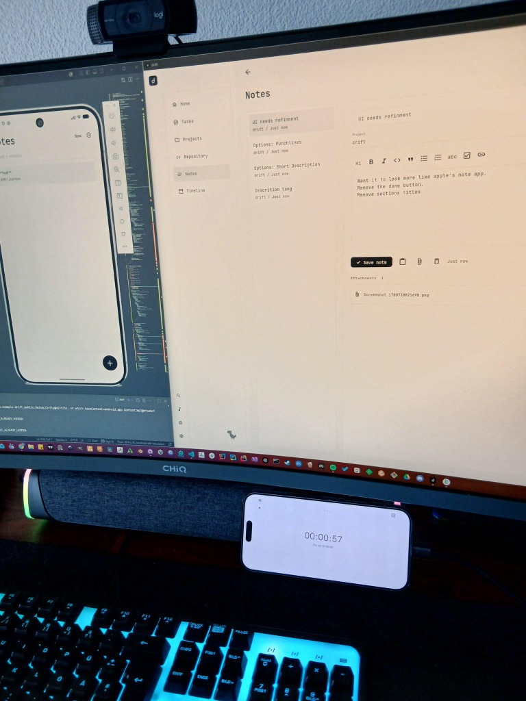

I've been working on drift, a project management tool for developers.

The idea is to keep tasks, notes, images, bugs and repository workflows connected instead of spreading them across multiple tools.

Currently working on desktop and mobile sync, repository integrations and local-first data storage.

### Local-First Persistence with SQLite

To lay the foundation for offline-first sync and better reliability, I migrated the local storage from legacy JSON/preference files to SQLite (using Drift ORM). 

Here is what's new:
- **SQLite Database Layer**: Moved notes, tags, media folders, images, and mobile uploads into transactional tables.
- **Robust Migrations**: Added schema versioning and upgrade paths to automatically migrate existing workspaces and media files without data loss.
- **Mobile Uploads & Sync**: Added dedicated entities to queue and sync mobile uploads and note updates.
- **Data Consistency**: Added soft-deletes and relational constraints to keep local states clean during background syncing.

Still very early, but it's starting to come together.
